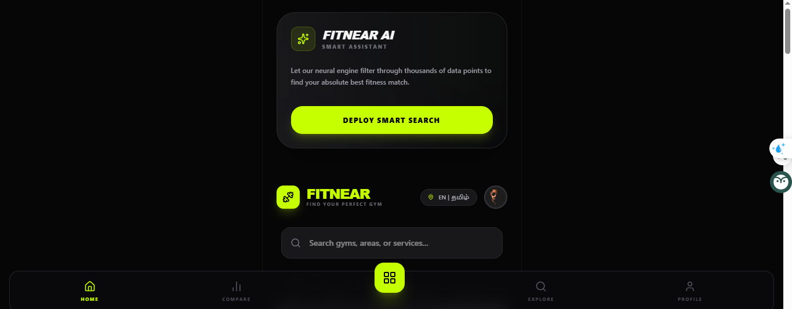
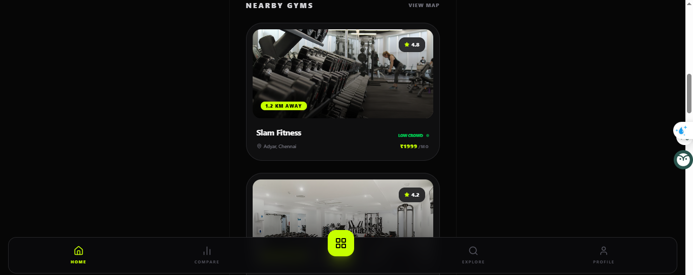
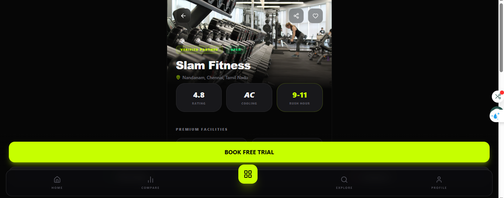
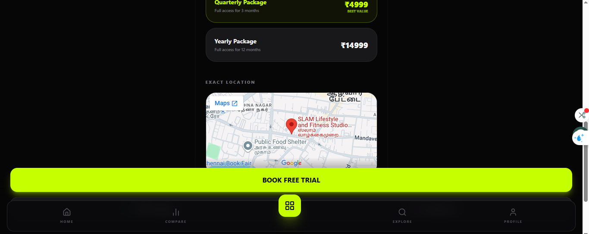
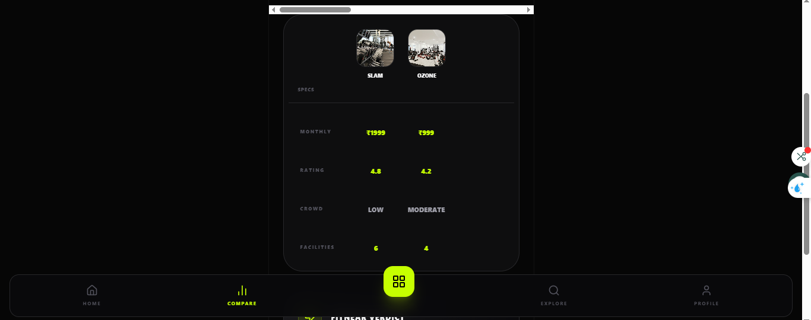
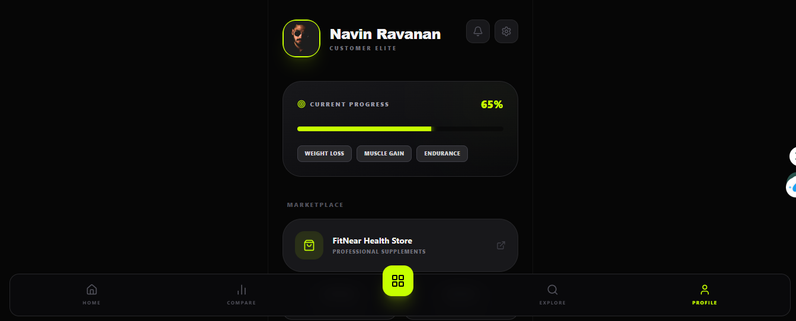
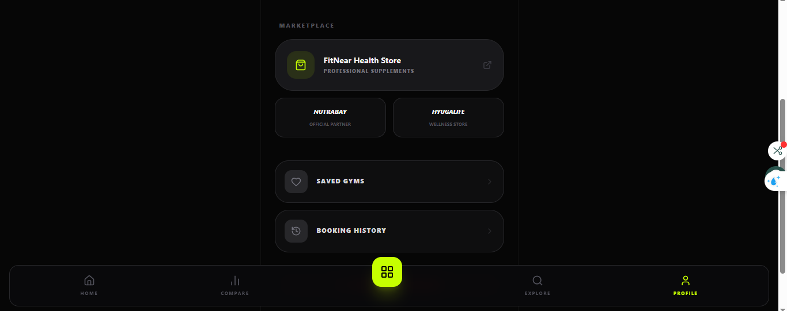

## 🖼️ App Screenshots

| Home | Listings | Gym Profile |
|------|----------|-------------|
|  |  |  |

| Plans & Location | Comparison | User Profile |
|------------------|------------|--------------|
|  |  |  |

| Marketplace |
|------------|
|  |
## ✨ Key Features

### 👤 User Features
- 📍 Find nearby gyms using GPS
- 🔍 Search gyms by city / area
- 💰 Compare subscription plans
- 🏋️ View trainers available
- ⭐ Ratings & Reviews
- 📞 WhatsApp contact gym owners
- 🎟️ Free trial booking
- 📊 Live crowd status
- 🌙 Dark mode
- 🌐 Tamil + English support

### 🏢 Gym Owner Features
- Create gym profile
- Upload photos/videos
- Add membership plans
- Manage leads
- View customers
- Earnings dashboard

### 🛡️ Admin Features
- Manage gyms
- Approve listings
- Reports dashboard
- Revenue analytics

---

## 🎯 Unique Selling Points

- Live crowd indicator  
🟢 Low Crowd | 🟠 Moderate | 🔴 Heavy

- Verified pricing transparency

- Local gym discovery platform for India

- Supplement recommendations from professionals

- Compare gyms side-by-side

---

## 🛠️ Tech Stack

| Technology | Usage |
|-----------|------|
| Flutter / React Native | Mobile Frontend |
| Firebase | Backend |
| Firestore | Database |
| Google Maps API | Location & Maps |
| Razorpay | Payments |
| Figma | UI/UX Design |

---

## 📂 Project Structure

```bash
fitnear-local-gym-finder/
│── assets/
│── screenshots/
│── lib/
│── components/
│── services/
│── pages/
│── firebase/
│── README.md
## 📈 Future Enhancements

- 🤖 AI Gym Recommendation Engine  
- 🍎 Nutrition Plans  
- 🎁 Reward Points System  
- 🏆 Fitness Challenges  
- 🧑‍🏫 Online Trainer Booking  
- 🛒 Supplement Marketplace  

---

## 🌍 Market Focus

Launching first in:

- Chennai  
- Coimbatore  
- Bangalore  
- Hyderabad  
- Madurai  

Then scaling across India 🇮🇳

---

## 🤝 Contributing

Contributions are welcome.

1. Fork the repository  
2. Create a feature branch  
3. Commit your changes  
4. Push your branch  
5. Open a Pull Request  

---

## 📜 License

MIT License

---

## 👨‍💻 Developer

**Navin R**  

Passionate about building real-world tech solutions in fitness, data, and innovation.

---

## ⭐ Support

If you like this project:

- 🌟 Star this repository  
- 🍴 Fork it  
- 📢 Share it  

---

# 🏋️ FitNear

### Train Smart. Join Right. Stay Fit. 💪


<div align="center">

</div>

# Run and deploy your AI Studio app

This contains everything you need to run your app locally.

View your app in AI Studio: https://ai.studio/apps/5d59a755-27b4-4826-a24a-352da9671f9f

## Run Locally

**Prerequisites:**  Node.js


1. Install dependencies:
   `npm install`
2. Set the `GEMINI_API_KEY` in [.env.local](.env.local) to your Gemini API key
3. Run the app:
   `npm run dev`
